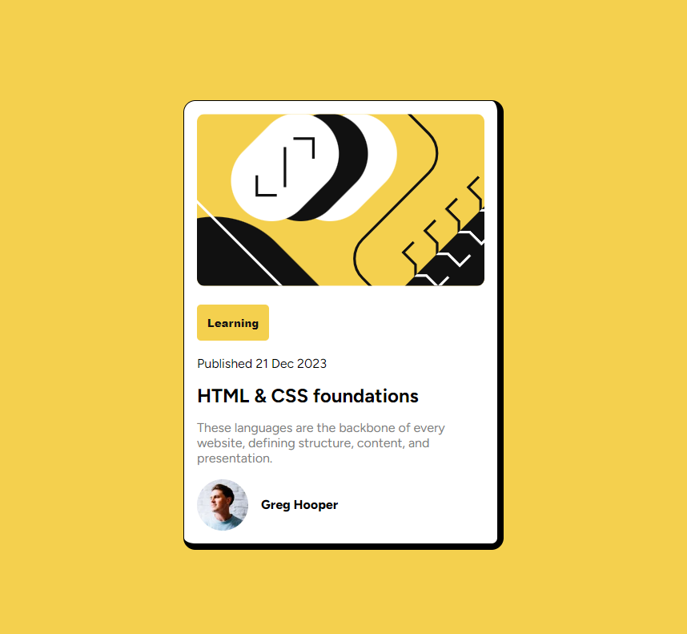

# Frontend Mentor - Blog Card Component

This is a solution to the [Blog Card Component](https://www.frontendmentor.io/challenges/blog-preview-card-ckPaj01IcS). 

## Table of contents

- [Overview](#overview)
  - [The challenge](https://www.frontendmentor.io/challenges/blog-preview-card-ckPaj01IcS)
  - [Screenshot](./assets/images/web.png)
- [Author](#author)

## Overview

### Screenshot

### Links

- Solution URL: [[https://github.com/rugarcia25/blog-card-component](https://github.com/rugarcia25/blog-card-component)] 
- Live Site URL: [[https://rugarcia25.github.io/blog-card-component/](https://rugarcia25.github.io/blog-card-component/)]

### Built with

- Semantic HTML5 markup
- CSS custom properties
- Flexbox
- CSS Grid
- Mobile-first workflow

## Author

- Website - [Rubén Garcia](https://rgdev.netlify.app/)
- Frontend Mentor - [@rugarcia25](https://www.frontendmentor.io/profile/rugarcia25)
- Github - [@rugarcia25](https://github.com/rugarcia25)
